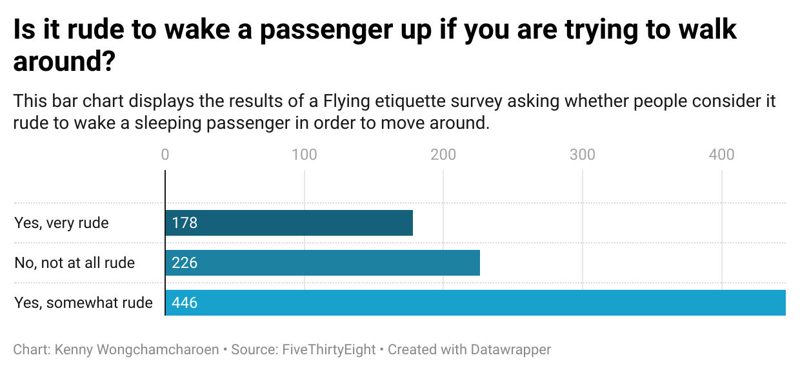

# Journalism 124 Week 4 Homework

## Why I Picked This Question
I chose the question *“Is it rude to wake a passenger up if you are trying to walk around?”* because it's a relatable social dilemma many people face while flying. I was curious to see what the general public considers polite or rude in shared spaces like airplanes, as I often wonder it myself when I am on a long flight and need to stretch.

## What I Found Interesting about the dataset
What I found especially interesting is how divided opinions can be on relatively simple actions, like waking someone up to move around. Even though flying is a shared experience, the range of responses shows that social norms aren't universally agreed upon. The dataset highlights subtle cultural expectations and helps visualize social gray areas that aren’t often formally studied.

## What the Chart Shows
The bar chart clearly visualizes the distribution of opinions, making it easy to compare the three response categories. It shows that most people lean toward the middle ground—acknowledging the rudeness but not strongly condemning it—while fewer people consider it *very rude* or *not rude at all*. While a majority (446 out of 1,040) thought it was *somewhat rude*, a sizable portion (226 people) felt it was *not at all rude*, showing a clear divide in opinion. This shows how subjective social norms can be and how context-sensitive actions are interpreted differently by different people.

